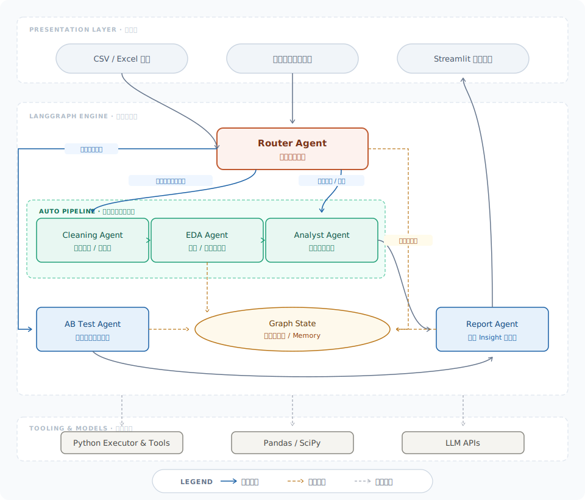

# DataMind 🧠


[](https://datamind-multi-agent.streamlit.app/)

DataMind 是一个基于 **Streamlit** 和 **LangGraph** 的自动化数据分析辅助平台。通过五个专职 AI Agent 的智能协同，将传统繁琐的「数据检测 -> 智能分析 -> 洞察生成」流程转化为一套自动化智能 Pipeline，旨在探索 AI 在提升数据分析生产力上的实际应用。

> 💡 **项目说明**：本项目是一个技术原型与探索实践，主要展示如何利用 LLM 编排复杂的数据分析工作流。通过将数据分析的最佳实践沉淀入 Agent 逻辑中，实现了一键式、结构化的分析反馈。

---

## 🎯 核心特性 (Features)

*   **🚀 Auto-Pipeline 多 Agent 自动协作**
    基于 LangGraph 的有向无环图 (DAG) 状态机架构，实现了：
    *   `Router Agent`：全局调度与业务场景嗅探。
    *   `Cleaning Agent`：异常值诊断、缺失值填补建议。
    *   `EDA Agent`：自动化探索性数据分析及图表洞察。
    *   `Domain Analyst Agent`：根据识别场景（电商、营销留存等），自动执行 RFM / 队列分析。
    *   `Report Generator`：整合分析结论，生成管理友好的决策报告。
*   **✨ 高级 SaaS 交互与 UI (Glassmorphism & Depth)**
    告别传统 Streamlit 的单调，项目深度定制了光影、圆角、层次化卡片以及微动画（CSS 注入），提供具有“呼吸感”的 UI 体验。
*   **📊 一键动态 Dashboard**
    采用 Plotly 引擎，内置自适应的直方图、漏斗图和群组分析矩阵，保障了良好的数据可视化信息密度。

## ⚙️ 系统架构图 (Architecture)



## 📦 快速开始 (Quick Start)

### 1. 环境准备
确保本机已安装 Python 3.11+
```bash
git clone https://github.com/notwulin/Datamind.git
cd datamind

# 创建并激活虚拟环境
python -m venv venv
source venv/bin/activate  # Windows 为 venv\Scripts\activate

# 安装依赖
pip install -r requirements.txt
```

### 2. 配置大模型 API Keys
创建 `.env` 文件并填入您的 LLM 密钥（系统兼容 LangChain 接口接入的大语言模型）：
```env
GOOGLE_API_KEY="your_gemini_api_key"
DEFAULT_LLM=gemini
# 或添加其他模型配置
```

### 3. 运行平台
```bash
streamlit run app.py
```

### 4. Demo 数据体验
在网页启动后，您可以直接从项目自带的 `data/` 目录下上传我们提供的测试数据集 `sample_ecommerce.csv` 体验完整流程。

---

## 📅 版本记录
详细的版本迭代历史请参阅 [CHANGELOG.md](CHANGELOG.md)。

## 📝 许可证 (License)
本项目基于 [MIT License](LICENSE) 协议开源。
